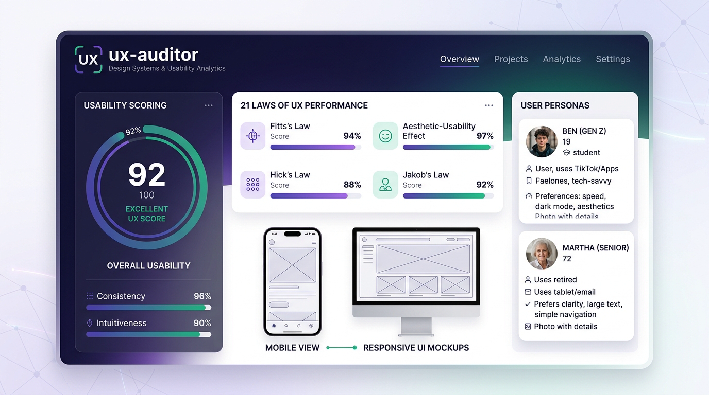
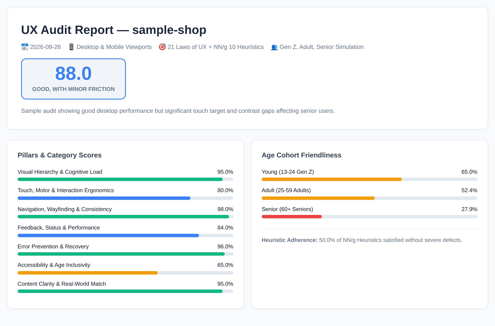
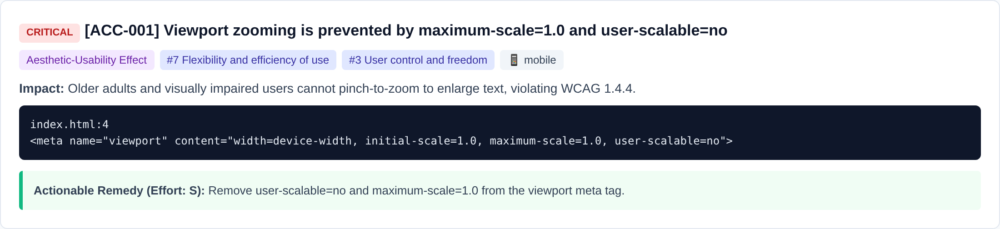

# ux-auditor

**A UX & usability audit for your web apps and codebases, run by [Claude Code](https://claude.com/claude-code) and [Google Antigravity](https://github.com/google).**

It scans your code, opens your running application in a real browser across **Desktop (1440×900)** and **Mobile (390×844 touch)** viewports, and evaluates usability against the **[21 Laws of UX](https://lawsofux.com/)** and the **[NN/g 10 Usability Heuristics](https://www.nngroup.com/articles/ten-usability-heuristics/)**. It produces a scored report where every finding cites the specific law or heuristic involved, provides concrete evidence (`file:line` or DOM bounding box measurements in px), explains user impact, and provides copy-paste code remedies. It also simulates demographic age cohort friction across **Digital Natives (Gen Z/Alpha)**, **Working Adults**, and **Older Adults (60+ Seniors)**.

Built as a Claude Code & Antigravity plugin. The skills install into any agent that reads `SKILL.md` (Gemini CLI, OpenAI Codex, Cursor), and the scanners and report pipeline run standalone in Python and CI/CD. See [using it with other agents](#using-it-with-other-agents).

> [!IMPORTANT]
> This is an automated technical UX and heuristic evaluation, **not a replacement for live human usability testing**. Use it to eliminate ergonomic defects, reduce cognitive friction, and ensure accessibility before putting your app in front of users.

> [!NOTE]
> Initial release (v1.0.0). The static scanner, Playwright dual-viewport runtime inspector, and multi-agent report pipeline are covered by automated test suites. Feedback and contributions are welcome.



## Contents

- [What it does](#what-it-does)
- [Quick start](#quick-start)
- [Example finding](#example-finding)
- [Commands](#commands)
- [What it checks](#what-it-checks)
- [How it works](#how-it-works)
- [Using it with other agents](#using-it-with-other-agents)
- [Privacy and safety](#privacy-and-safety)
- [Troubleshooting](#troubleshooting)
- [Updating and uninstalling](#updating-and-uninstalling)
- [Using the scripts without Claude](#using-the-scripts-without-claude)
- [Contributing](#contributing)
- [Limitations](#limitations)
- [Credits and license](#credits-and-license)

---

## What it does

- **Checks touch targets in a real browser (Fitts's Law):** Measures real rendered bounding boxes. Flags targets smaller than 44×44px (Apple HIG) or 48×48px (Google Material/Android), flags tight target spacing (<8–12px) causing mistaps, and inspects mobile thumb-zone reachability.
- **Audits cognitive load and chunking (Miller's Law & Hick's Law):** Detects forms with >10 unchunked fields, un-grouped select menus, and ambiguous label-to-input proximity.
- **Inspects dual-viewport responsiveness:** Evaluates Desktop (1440×900) and Mobile (390×844) viewports independently. Flags horizontal scroll blowouts (`scrollWidth > innerWidth`) and disabled viewport zooming (`user-scalable=no`).
- **Simulates demographic age cohort friction:**
  - **Gen Z & Alpha (13–24):** Low patience thresholds (<300ms feedback latency), mobile-first thumb ergonomics, visual scannability.
  - **Working Adults (25–59):** Task efficiency, keyboard navigation (`:focus-visible`), autofill compliance (Parkinson's Law), multi-step wizard state retention.
  - **Older Adults & Seniors (60+):** High contrast ratios (WCAG AAA ≥7:1), minimum body font size (≥16px), touch targets ≥48px with 12px margins, explicit text labels on all icons (no mystery-meat icons).
- **Reviews feedback and the Doherty Threshold (<400ms):** Flags async submit buttons missing loading spinners or disabled states, missing skeleton loaders, and uncelebrated success states.
- **Audits error resilience (Postel's Law):** Verifies forgiving input handling (phone numbers, cards, dates), inline error guidance, and confirmation guards on destructive actions.
- **Generates scored deliverables and action plans:** Produces `UX-AUDIT-REPORT.md`, a phased `ACTION-PLAN.md` (P0 Quick Wins, P1 Mobile & Ergonomics, P2 Polish), `personas-analysis.md`, and an interactive standalone `ux-audit-report.html` with 1-click print-to-PDF styles.

---

## Quick start

### 1. Prerequisites

| Need | Why |
|---|---|
| [Claude Code](https://docs.claude.com/en/docs/claude-code/overview) or [Google Antigravity](https://github.com/google) | Runs the skills and specialist agents. |
| Python 3.8 or newer | Core scanners and report pipeline use Python standard library only. |
| *Optional:* Playwright + Chromium | Headless browser checks across Desktop and Mobile viewports. |

Install Playwright if you want browser checks:

```bash
pip install playwright
python -m playwright install chromium
```

### 2. Install the plugin

Inside Claude Code:

```bash
/plugin marketplace add Capzel/ux-auditor
/plugin install ux-auditor@ux-auditor
```

Or from your terminal:

```bash
claude plugin marketplace add Capzel/ux-auditor
claude plugin install ux-auditor@ux-auditor
```

For Google Antigravity or Gemini CLI:

```bash
git clone https://github.com/Capzel/ux-auditor.git
cd ux-auditor
python3 scripts/install_skills.py --agent antigravity --scope user
```

*(See [Using it with other agents](#using-it-with-other-agents) for Codex, Cursor, and custom setups).*

### 3. Run your first audit

Open your agent in the project you want to audit and run:

```
/ux audit . --url http://localhost:3000
```

What happens:

1. **Scope questions.** The agent asks (once) whether there's a running app URL to test, which viewports to prioritize, and which age cohorts to simulate.
2. **Evidence collection.** Local Python scripts scan the code and inspect the running app in both Desktop and Mobile viewports via Playwright. Results and screenshots go to `ux-audit/<project>-<date>/evidence/`.
3. **Specialist analysis.** Seven agents (one per category) run in parallel, confirm each lead by reading your code and DOM measurements, and write findings.
4. **Report.** Findings are merged, validated, scored, and rendered.

You get:

```
ux-audit/<project>-<date>/
├── UX-AUDIT-REPORT.md        full report: summary, scores, findings, laws cited, remedies
├── ACTION-PLAN.md            prioritized checklist in phases: P0 Quick Wins → P2 Polish
├── personas-analysis.md      friction breakdown by age cohort (Gen Z, Adults, Seniors)
├── ux-audit-report.html      standalone interactive HTML report (print to PDF from browser)
├── audit-data.json           machine-readable findings
├── findings/                 per-category findings from each specialist
└── evidence/                 static scan, desktop & mobile runtime DOM data (+ screenshots)
```



> [!WARNING]
> Reports describe usability weaknesses and accessibility gaps. Add `ux-audit/` to your `.gitignore` and share reports deliberately.

For a lighter run without browser or agents, start with `/ux scan` or inspect a single URL with `/ux mobile http://localhost:3000`.

---

## Example finding



Every open finding has:

- **Severity** (critical → low), **status** (fail or warning), **confidence** (confirmed, likely, or possible), and the **evidence level** it rests on: static code, runtime browser, or questionnaire answers.
- **Viewport** (`desktop`, `mobile`, or `both`) and **Personas impacted** (`young`, `adult`, `senior`).
- **Laws of UX & Heuristics cited** linked directly to [lawsofux.com](https://lawsofux.com/) and NN/g articles.
- **Evidence** you can open: file and line numbers with masked snippets, or exact DOM selectors with pixel bounding box measurements.
- **Why it matters** in plain language explaining cognitive fatigue, motor frustration, or abandonment risk.
- **Actionable remedy** with an effort estimate (`S`, `M`, `L`) and copy-paste code snippets.

---

## Commands

Plugin commands are namespaced: `/ux-auditor:ux <command>` or `/ux <command>`.

| Command | What it does |
|---|---|
| `audit [path] [--url URL] [--pages ...]` | Full audit with all 7 categories, desktop & mobile runtime, and scored report |
| `scan [path]` | Fast static codebase summary in terminal, no browser or agents needed |
| `runtime --url URL [--pages ...]` | Headless Playwright audit of Desktop & Mobile viewports with screenshots |
| `mobile <url>` | Quick mobile viewport inspection (tap targets, overflow, thumb zone) |
| `desktop <url>` | Quick desktop viewport inspection (focus rings, hover, layout density) |
| `simulate [url] --persona senior\|young\|adult` | Targeted simulation evaluating interface friction for a specific age cohort |
| `report [audit-dir]` | Re-merge findings and re-render Markdown & HTML reports after edits |
| `fix <FINDING-ID> [audit-dir]` | Plan and implement the remedy for one finding in code, then verify |
| `laws [law-id]` | Browse the 21 Laws of UX library with takeaways and UI remedies |
| `heuristics [heuristic-id]` | Browse the NN/g 10 Usability Heuristics checklist |

Examples:

```
/ux audit . --url http://localhost:3000
/ux mobile https://staging.example.com
/ux simulate http://localhost:3000 --persona senior
/ux fix ERG-001
/ux laws fitts-law
```

---

## What it checks

| Category | Weight | Laws & Heuristics Covered | Examples | Evidence |
|---|---:|---|---|---|
| **Visual Hierarchy & Cognitive Load** | 15% | Hick's Law, Miller's Law, Law of Proximity, Common Region, Prägnanz, Aesthetic-Usability Effect, NN/g #6, #8 | Unchunked forms (>10 fields), menu complexity, card borders, label proximity | code, browser |
| **Touch, Motor & Interaction Ergonomics** | 20% | Fitts's Law, Parkinson's Law, Tesler's Law, NN/g #4, #7 | Mobile touch targets (<44/48px), target spacing (<8px), thumb zone, autofill tokens | code, browser |
| **Navigation, Wayfinding & Consistency** | 15% | Jakob's Law, Uniform Connectedness, Serial Position Effect, Pareto Principle, NN/g #3, #4 | Logo home link, breadcrumbs, modal escape traps (Esc key), consistent button tokens | code, browser |
| **Feedback, Status & Performance** | 15% | Doherty Threshold (<400ms), Goal-Gradient Effect, Peak-End Rule, Zeigarnik Effect, NN/g #1 | Submit button loading spinners, skeleton loaders, progress steppers, optimistic UI | code, browser |
| **Error Prevention & Recovery** | 15% | Postel's Law, Peak-End Rule, NN/g #5, #9 | Destructive action confirmation dialogs, forgiving phone/card formatting, inline errors | code, browser |
| **Accessibility & Age Inclusivity** | 10% | Aesthetic-Usability Effect, Senior Ergonomics, WCAG 2.1 AA/AAA, NN/g #4, #7 | WCAG contrast (4.5:1 / 7:1), body font size (≥16px), viewport zoom enabled, focus rings | code, browser |
| **Content Clarity & Real-World Match** | 10% | Jakob's Law, Occam's Razor, NN/g #2, #10 | Mystery-meat icon buttons, technical jargon vs plain language, empty states, tooltips | code, browser |

The full mapping of all 21 Laws of UX and 10 Heuristics is documented in [`coverage-matrix.md`](skills/ux-audit/references/coverage-matrix.md).

---

## How it works

```
/ux audit
│
├─ 1. Evidence: local Python scripts, standard library only
│     ux_scan.py        regex rules, component structures, responsive layouts
│     ux_runtime.py     Playwright: Desktop (1440x900) vs Mobile (390x844 touch)
│                      (computes bounding boxes, contrast math, and captures screenshots)
│
├─ 2. Analysis: 7 specialist agents in parallel
│     each confirms scanner leads in code and DOM measurements, writing findings as JSON
│
├─ 3. Age cohort simulation: Gen Z, Working Adults, Seniors
│     friction scoring across physiological and demographic thresholds
│
└─ 4. Report: validate → merge → score → Markdown + HTML + action plan
```

### Leads versus findings

The scanner detects static patterns that indicate potential friction; these hits are treated as **leads**. An agent only reports an open finding after confirming it in the code or real rendered browser DOM, and it must specify its confidence level (`confirmed`, `likely`, or `possible`).

### The 21 Laws of UX & Heuristics Guardrails

Findings cite principles strictly by ID from curated reference databases:
- [`data/laws_of_ux.json`](data/laws_of_ux.json): All 21 Laws from [lawsofux.com](https://lawsofux.com/), including origin, formula, and remedies.
- [`data/heuristics.json`](data/heuristics.json): All 10 Usability Heuristics from Nielsen Norman Group with full checklists.
- [`data/personas.json`](data/personas.json): Demographic cohorts with physiological attributes and ergonomic thresholds.

The report validator rejects unknown law or heuristic IDs, ensuring findings are grounded in verified usability science.

### Scoring

Each category starts at 100 points. Every open finding deducts:

```
severity points (critical 35 · high 20 · medium 10 · low 4)
  × confidence (confirmed 1.0 · likely 0.8 · possible 0.5)
  × status (fail 1.0 · warning 0.5)
```

The overall score is the weighted average across assessed categories:
- **90–100:** Optimal (Excellent UX)
- **75–89:** Good, with minor friction
- **50–74:** Needs improvement (Noticeable friction)
- **Below 50:** High friction (Severe usability defects)

### Repository layout

```
.claude-plugin/        plugin.json and marketplace.json
skills/
  ux/                  router skill + audit-standards.md (rules every agent follows)
  ux-audit/            orchestrator + findings schema, coverage matrix, questionnaire
  ux-<category>/       7 specialist skills with remedy guides (❌/✅ code examples)
agents/                7 thin agent definitions that run specialist skills in parallel
scripts/               scanner, runtime inspector, evidence view, report builder, installer
data/                  laws_of_ux.json, heuristics.json, personas.json
tests/                 unittest suites + fixtures (friction-shop, accessible-shop, sample-audit)
docs/images/           README visual assets
```

---

## Using it with other agents

Claude Code and Google Antigravity provide the smoothest experience, but they are not required. `SKILL.md` is an open format that other coding agents read, and the evidence and report scripts are plain Python.

```bash
git clone https://github.com/Capzel/ux-auditor.git && cd ux-auditor
python3 scripts/install_skills.py --agent codex       --scope user   # ~/.agents/skills
python3 scripts/install_skills.py --agent antigravity --scope user   # ~/.gemini/skills
python3 scripts/install_skills.py --dir ~/.cursor/skills             # anything else
```

The installer copies the skills and rewrites `${CLAUDE_PLUGIN_ROOT}` to the absolute path of your checkout so bundled scripts and data files resolve everywhere.

| Feature | Claude Code | Antigravity / Gemini CLI | Other Agents | No Agent (CI) |
|---|---|---|---|---|
| Evidence scripts & report pipeline | ✅ | ✅ | ✅ | ✅ |
| Audit logic, checks, remedies (skills) | ✅ automatic | ✅ after install | ✅ after install | as documentation |
| Seven specialists in parallel | ✅ | ✅ (Subagents) | sequential fallback | n/a |
| Slash commands and scope questions | ✅ | invoke by name, chat | invoke by name | n/a |

Full instructions, including CI usage and feeding findings from external tools: [`docs/other-agents.md`](docs/other-agents.md).

---

## Privacy and safety

**What runs where**
- All Python scripts run locally on your machine.
- The Playwright inspector loads only the URL you specify (preferably `localhost` or staging) and makes no external requests beyond what that page loads.
- Files and command outputs are analyzed locally within your agent session. Nothing is uploaded to third-party services.

**What the audit will not do**
- **Modify your code without approval.** `/ux fix` shows a proposed diff and waits for your confirmation.
- **Submit live payment forms or delete production data.** Runtime browser checks inspect read-only DOM layout.
- **Copy secrets into reports.** Snippets pass through automatic masking in `ux_common.py`.

---

## Troubleshooting

| Problem | Fix |
|---|---|
| `/ux` isn't listed | Run `/plugin` to ensure the plugin is enabled, or restart Claude Code. |
| `python3: command not found` | Install Python 3.8+, or configure your environment to use `python`. |
| Browser checks skipped | Run `pip install playwright && python -m playwright install chromium`. |
| Scan is slow on large repo | Run scan pointing directly to your frontend app directory (e.g. `/ux scan ./apps/web`). |
| A finding is inaccurate | Edit or delete it in `findings/<category>.json`, then run `/ux report`. Open an issue with the pattern so rules can improve. |

---

## Updating and uninstalling

Inside Claude Code:

```bash
claude plugin marketplace update ux-auditor
claude plugin update ux-auditor@ux-auditor

claude plugin uninstall ux-auditor@ux-auditor
claude plugin marketplace remove ux-auditor
```

---

## Using the scripts without Claude

The evidence and report scripts work on their own, for example in CI/CD pipelines:

```bash
python3 scripts/ux_scan.py path/to/app --format summary          # terminal summary
python3 scripts/ux_scan.py path/to/app --output scan.json        # full JSON evidence
python3 scripts/ux_runtime.py --url http://localhost:3000 --output runtime.json --screenshots shots/
python3 scripts/ux_report.py merge --audit-dir ux-audit/myapp-run
python3 scripts/ux_report.py render --data ux-audit/myapp-run/audit-data.json
```

Render the bundled sample report to preview output formats:

```bash
cp -r tests/fixtures/sample-audit /tmp/ux-sample
python3 scripts/ux_report.py merge --audit-dir /tmp/ux-sample
python3 scripts/ux_report.py render --data /tmp/ux-sample/audit-data.json
```

---

## Contributing

Contributions are welcome, especially new static detection rules, additional framework remedies (React, Vue, Svelte, Tailwind), and refined age cohort parameters.

**Develop locally**

```bash
git clone https://github.com/Capzel/ux-auditor.git
cd ux-auditor
python3 -m unittest discover -s tests -v    # run automated test suite
claude --plugin-dir .                        # test in Claude Code
```

**Ground rules**
- **Rules** (`scripts/ux_rules.py`): Every rule must cite specific Laws of UX and NN/g Heuristics, specify severity and confidence, and include a concrete remedy. Add a triggering line to `tests/fixtures/friction-shop`, and keep `tests/fixtures/accessible-shop` clean.
- **Scripts**: Must stay compatible with Python 3.8 and standard library only (no external dependencies except optional Playwright for browser checks).
- **Masking**: Never output secrets or raw credentials.

More details in [`CLAUDE.md`](CLAUDE.md).

---

## Limitations

- Automated heuristic evaluation cannot replace real user usability testing or observing humans interact with your product.
- Browser checks inspect public, accessible routes. Authentication-gated flows are reviewed primarily via static code analysis.
- Color contrast calculations currently evaluate solid and semi-transparent CSS colors; complex background image textures or CSS canvas overlays should be verified manually.

---

## Credits and license

- Laws of UX curated by [Jon Yablonski](https://jonyablonski.com/) at [lawsofux.com](https://lawsofux.com/).
- 10 Usability Heuristics for User Interface Design by [Jakob Nielsen](https://www.nngroup.com/people/jakob-nielsen/) at [Nielsen Norman Group](https://www.nngroup.com/).
- Architectural layout inspired by [`claude-gdpr-audit`](https://github.com/Capzel/claude-gdpr-audit).

Released under the [MIT License](LICENSE).